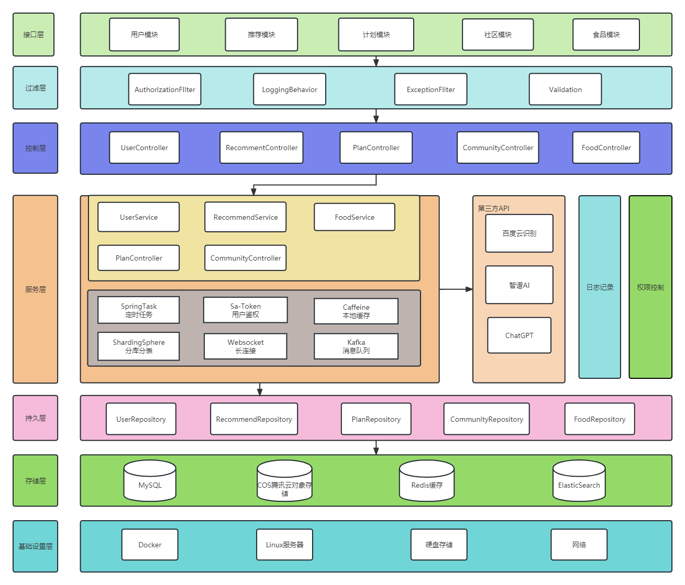

# 食光烙记 (Food Record System)

<p align="center">
  
</p>

<p align="center">
  <a href="LICENSE">
    
  </a>
  <a href="#">
    
  </a>
  <a href="#">
    
  </a>
  <a href="#">
    
  </a>
  <a href="#">
    
  </a>
</p>

> 食光烙记是一个智能饮食记录和营养分析系统,旨在帮助用户科学饮食、合理营养。通过记录日常饮食、分析营养摄入、智能推荐食谱,让健康饮食成为一种生活方式。

[English](README_EN.md) | 简体中文

一个基于Spring Boot的智能饮食记录和营养分析系统。

## 项目概述

本系统提供全面的饮食记录、营养分析和智能推荐功能可以帮助用户更好地管理饮食健康。

### 核心功能

- 用户管理
  - 用户注册、登录、注销
  - JWT认证授权
  - 权限控制
  - 密码加密和验证

- 食物管理
  - 食物基本信息管理
  - 营养成分管理
  - 维生素管理
  - 矿物质管理
  - 场景管理
  - 血糖指数管理

- 饮食记录
  - 用户饮食记录
  - 饮食目标管理
  - 饮食统计分析
  - 营养分析

- 智能推荐
  - 食物推荐算法
  - 营养建议生成
  - 用户画像分析

- 通知系统
  - 邮件通知
  - 站内消息
  - WebSocket实时推送

- 数据导入导出
  - Excel导入导出
  - 数据模板生成

### 技术栈

#### 后端技术

   
   
   
   
   
 
#### 项目环境
   
   
   
   

## 系统架构

### 整体架构


## 快速开始

1. 安装必要的开发工具
```bash
 sudo apt install openjdk-11-jdk
 # 安装JDK 11
 
 # 安装Maven
 sudo apt install maven
 
 # 安装Docker
 curl -fsSL https://get.docker.com | bash -s docker
 ```
2. 启动必要的服务
```bash
 # 启动MySQL
 docker run -d --name mysql -p 3306:3306 -e MYSQL_ROOT_PASSWORD=root mysql:5.7
 
 # 启动Redis
 docker run -d --name redis -p 6379:6379 redis:6.0
```

### Docker部署

1. 构建镜像
```bash
 # 构建应用镜像
 docker build -t food-record:latest .
```

2. 启动容器
```bash
 # 启动应用容器
 docker-compose up -d
```
### Kubernetes部署

1. 部署应用
```bash
 # 部署应用
 kubectl apply -f k8s/
```

2. 查看状态
```bash
 # 查看Pod状态
 kubectl get pods
```

## API文档

启动项目后访问：http://localhost:8080/swagger-ui.html

## 项目进度

- [✔] 后端基础架构 (95%)
- [✔] 核心业务功能 (85%)
- [✔] 安全框架 (90%)
- [✔] 数据访问层 (85%)
- [✔] 缓存系统 (80%)
- [✔] 智能推荐 (75%)
- [✔] 通知系统 (70%)

## 待办事项

1. 完善系统监控功能
   - 性能监控
   - 资源监控
   - 操作日志
   - 告警通知

2. 添加定时任务支持
   - 数据统计
   - 推荐计算
   - 缓存更新

3. 集成消息队列
   - 异步处理
   - 削峰填谷

4. 补充单元测试
   - 服务层测试
   - 控制器测试
   - 安全测试

## 贡献指南

1. Fork 项目
2. 创建功能分支
3. 提交代码
4. 创建 Pull Request

## 许可证

[MIT License](LICENSE)# shiguang-brand
# shiguang-brand
